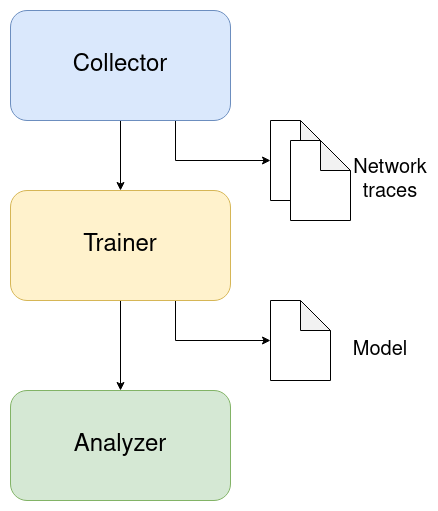

# SDN_ML
This project implements network analysis through the use of an SDN Controller and Machine Learning for trying to detect abnormal traffic in a network. The project is modular and requires a python version greater or equal to 3.6.

The project will consist of three modules later explained in detail:
* An SDN Controller
* A network connected to the controller
* A network analyzer

## SDN Controller

Software Defined Networks allow more eficient management of new generation networks by decoupling the control and data plane. The data plane remains in network devices while the control plane is implemented in an SDN Controller.

Besides its basic functionality, several SDN Controllers collect statistics of the network they control. Our approach is to use the SDN Controller to obtain these statistics and use them to train and test an AI.

The default configuration of this project will make use of a dockerized ONOS Controller. To start it, you may execute the following command:
```
docker run -t -d -p 8181:8181 -p 8101:8101 -p 5005:5005 -p 830:830 -p 6653:6653 --name onos onosproject/onos
```

Then make sure that the _drivers_, _openflow_ and a networking app (like _fwd_) are activated.

The project design is modular, so the SDN Controller is nearly independent from the other modules. However if you want use a different SDN Controller make sure to update the settings and perhaps some additional code not yet implemented may be required.

## Network

This module consits of the network devices connected to the SDN controller. There is no other hard restriction, the topology may change (save for certain points) and it doesn't matter if it's a physical or a virtual network.

The default netowrk for this project will make use of [mininet](http://mininet.org/) for virtualization. The [software](http://mininet.org/download/) and python library are required for our scenario. The latter can be installed with:
```
pip install -r requirements_dev.txt
```

And then, the sample ring topology can be run like this:
```
python topology.py
```

TODO include image of topology

The hosts of the topology are programmed to send 5 ICMP messages to another random host constantly and with approximately 1% of chance sent 20 much larger packets. This way most of the traces will be normal but on average a few of them should present an abnormal traffic pattern caused by the larger packets.

This module is connected just to the SDN Controller, so any SDN network should suffice.

## Network Analyzer

The last module is the network_analyzer. This module collects traffic statistics both to train and to make use of an AI.

It is divided in three submodules itself:
* Collector: stores network traffic traces.
* Trainer: retrieves the network traffic traces and classifies them if required to generate a training set for the AI.
* Analyzer: once the AI is trained, the analyzer collects traffic information in real time and estimates a probability of abnormal traffic.



Each of this submodules has particular functionality that can be configured through the settings file. Also a whole different submodule may be used if implemented and specified in the settings (as long as it implements a _run_ method).

It should also be noted that the stages the first submodules implement may be skipped after being completed just once or by performing manual tasks, so the network analyzer module can be started at any stage.

### Collector

As previously indicated, this submodule collects traffic information from the SDN Controller for longs periods of time and generates network traces.

The default collector obtains information from an ONOS controller and saves it in yaml files with the following structure:
```
data:
  - switch:
      port:
        received: bytes received during 10 seconds
        sent: bytes sent during 10 seconds
      [...]
    [...]
  - [...]
```

The number of traces to be stored and how many samples will be included per trace can be modified in the settings (make sure the last value matches with the one configured for the analyzer).

The default implementation is designed as a proof of concept to gather data as quickly as possible. This causes many values to be reused in several traces. In order to obtain a more realistic dataset, a new collector should be implemented or even the traces be already provided.

To start this stage run:
```
python run_analyzer.py --collector
```

It is recommended to not modify network topology during this stage as it can create inconsistencies in the network traces.

### Trainer

In this stage the network traces previously generated or provided are retrieved, a training dataset is generated and an AI model is created.

The default trainer will also classify the network traces between normal and abnormal if they weren't already by adding the following line to the yaml file:
```
normal: true
data:
  [...]
```

This step can potentially be troublesome since it may force the AI to mimic the implemented algorithm, by default checking if some of the received traffic differs from the average by more than relative margin.

For the AI to truly make use of all of its capabilities, it would be recommended that classification is manually performed.

For the training set, the average and standard deviation of the bitrate per link during intervals of ten seconds will be calculated. Once we have a certain number of this tuples it will become our input vector for keras. This vectors are independent of the number of links and switches so theoretically could be used for different topologies but there is no guarantee that the values of the _normal_ behaviour of the new topology don't differ from those used during the training.

TODO include representation of a list of 10 average-deviation tuples.

The model will be generated with keras using tensorflow as backend. It will use a [basic classification of images keras example as template](https://www.tensorflow.org/tutorials/keras/basic_classification). So the output will be the probability that the vector belongs to the groups _normal_ or _abnormal_.

This stage triggers automatically after the collector is finished and can also be started manually by executing:
```
python run_analyzer.py --trainer
```

Again, different trainers can be implemented and indicated in the settings file.

### Analyzer

The analyzer collects traffic information in real time and estimate the probability that there is an abnormal traffic in the network. The input data is technically agnostic from the network topology so the analyzer can work after changes. It is recommended however to repeat the previous stages if the network topology goes through major changes.

The default analyzer will represent this data through a simple graphic interface that displays the evolution of the probablity of abnormal traffic during a short period of time.

TODO include an image of said GUI

Like with the previous stages, different trainers can be implemented and executed by includeng them in the settings file. This stage also triggers inmediatly after the trainer is finished and can be manually run with:
```
python run_analyzer.py --analyzer
```

## Next Steps

There are several improvements that could be applied to this project. Some of them include:

* Implement collectors and analyzers for more SDN Controllers
* Implement an alert in analyzer when the probability of abnormal traffic exceeds a certain threshold.
* Implement an SDN application to take measures when abnormal traffic is detected.
* Implement new trainers and analyzers capable of telling apart different abnormal traffic scenarios.
* Integrate the network analyzer with an SDN application.

The project is open to collaboration from anyone that desires to.
